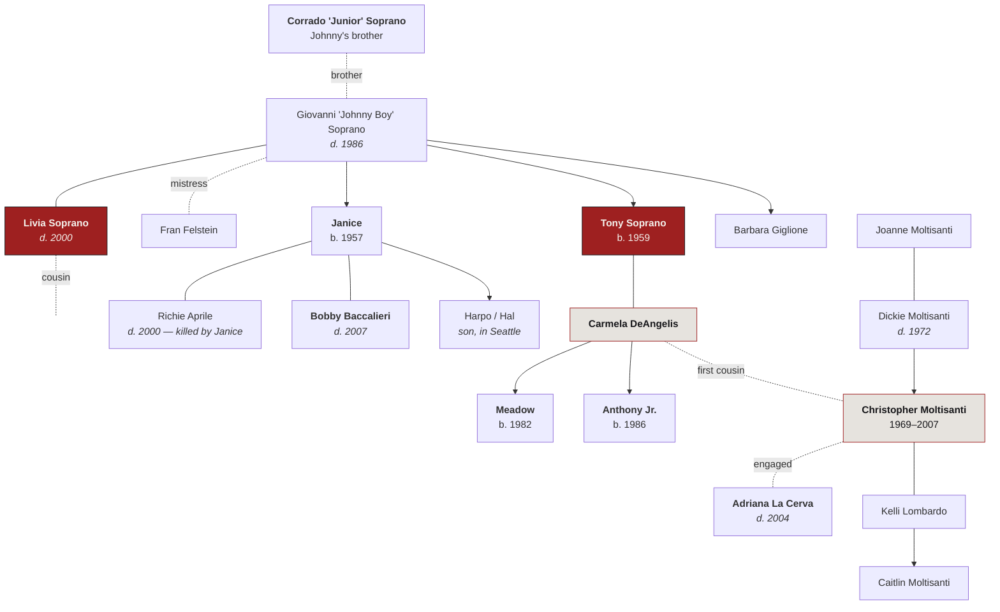
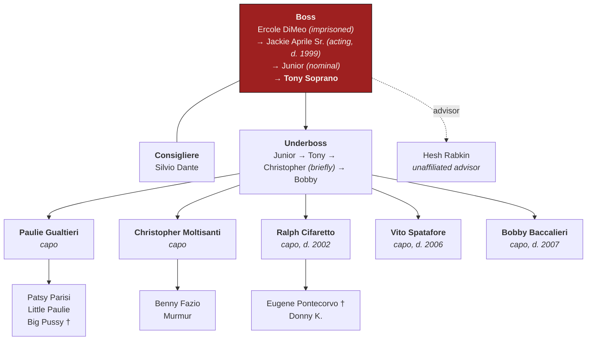

# Family Tree

---

## The bloodline

*Dates are reconstructed from on-screen references and are approximate. The show is deliberately loose about ages.*

---

## Reading it

**Christopher's exact relationship to Tony** is the thing everyone gets wrong, including characters in the show. Christopher is **[Carmela's](carmela-soprano.md) first cousin** — the son of Dickie Moltisanti — which makes him Tony's cousin **by marriage**, not blood. Tony calls him his nephew throughout, and functionally he is: Tony took over as his father figure after Dickie's death, and that relationship is the engine of both their arcs.

**Dickie Moltisanti** is the subject of [*The Many Saints of Newark*](../series/the-many-saints-of-newark.md). The series treats him as a legend; the film shows the man.

**Janice's marriages** are a pattern. She takes up with [Richie Aprile](richie-aprile.md) and shoots him at the dinner table when he hits her. She then marries [Bobby Baccalieri](bobby-baccalieri.md), the gentlest man in the organization, and steadily makes him worse.

---

## The DiMeo crime family

**Consigliere** is a counselor, outside the chain of command. **Underboss** is second. A **caporegime** runs a crew in a territory. **Hesh Rabkin**, being Jewish, can never be a made member and is Tony's most trusted business advisor anyway — the same structural joke the genre has been running since Tom Hagen.

Definitions: [Glossary](../reference/glossary.md).

---

## New York — the Lupertazzi family

| Role | Who | Fate |
| --- | --- | --- |
| Boss | Carmine Lupertazzi Sr. | Dies of a stroke, S5 |
| | Carmine Lupertazzi Jr. ("Little Carmine") | Withdraws from the succession |
| Boss | **[Johnny Sack](johnny-sack.md)** | Arrested, imprisoned, dies of lung cancer S6 |
| Boss | **[Phil Leotardo](phil-leotardo.md)** | Killed, S6E86 |
| Underboss | Butch DeConcini | Cuts a deal with Tony in the finale |

The New York/New Jersey relationship is the show's long-running status wound: New York is bigger, richer, and treats Jersey as a subsidiary, and Tony spends six seasons managing that resentment. It is also the closest thing the series has to a plot engine, and it's what finally boils over in season six.

---

## See also

- [Character index](index.md) · [Timeline](../data/timeline.md) · [Body Count](../data/body-count.md)
- [Glossary](../reference/glossary.md) · [Real-World Mafia](../reference/real-world-mafia.md)
